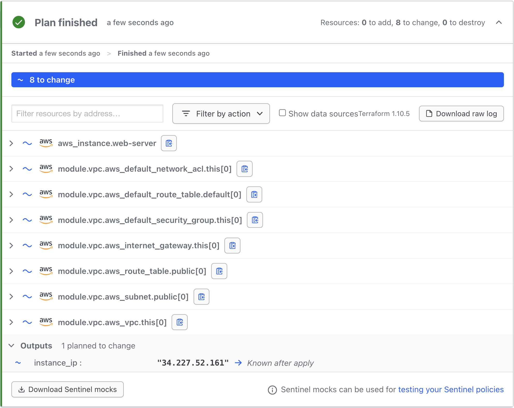

# Terraform Cloud Demo Repository

Welcome to the **Terraform Cloud Demo Repository**! This repository demonstrates how to use **Terraform Cloud** to provision AWS infrastructure efficiently and securely.

## Benefits of Terraform Cloud:
- [x] Good for larger teams of Cloud Engineers  
- [x] Remote execution of `terraform plan`, `apply`, and `destroy`  
- [x] Integration with VCS  
- [x] Remote state storage  
- [x] Registry for Terraform Modules  
- [x] Notifications via Slack, Email, Webhook  
- [x] Different access levels for users (some deploy one thing, others another)  
- [x] Sentinels – rules for infrastructure provisioning (paid feature)  
- [x] Cost Estimation – allows approximate infrastructure cost evaluation  

## Overview
This Terraform configuration deploys the following AWS resources:
- **VPC** – A dedicated network for your infrastructure.
- **Security Group** – Defines inbound/outbound traffic rules.
- **EC2 Instance** – A virtual machine running with automated setup via user data.

## Getting Started
### Prerequisites
Before you begin, ensure you have the following:
- **AWS Account** with appropriate permissions.
- **Terraform CLI** installed ([Download Here](https://developer.hashicorp.com/terraform/downloads)).
- **Terraform Cloud API Token** (for remote state management and automation).

### Setup & Deployment Steps
1. **Fork & Clone** this repository to your local machine.
2. **Connect the Repository** to Terraform Cloud.
3. **Create a Workspace** in Terraform Cloud.
4. **Set Workspace Variables** (e.g., AWS credentials, region, etc.).
5. **Queue a Terraform Plan & Apply** to deploy infrastructure.

## Useful Commands
```bash
# Initialize Terraform
terraform init
```

```bash
# Validate the configuration
terraform validate
```

```bash
# Preview changes
terraform plan
```

```bash
# Apply changes
terraform apply -auto-approve
```

```bash
# Destroy resources
terraform destroy -auto-approve
```

### Terraform Cloud Workspace
- **Demo Image**:


🚀 **Happy Terraforming!** 🚀

